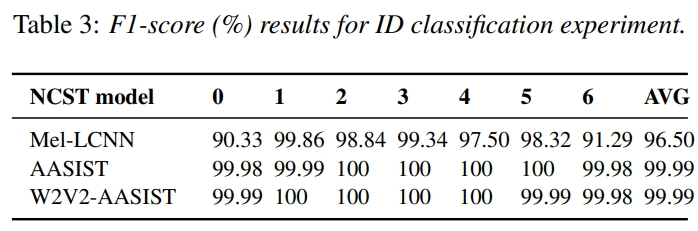
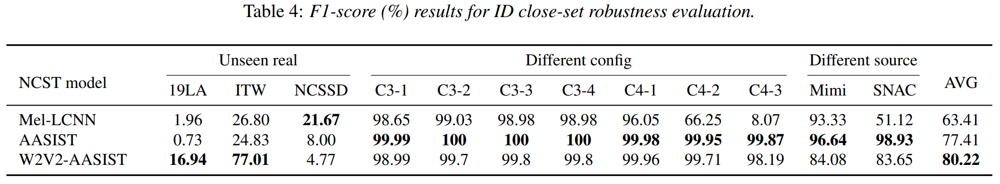
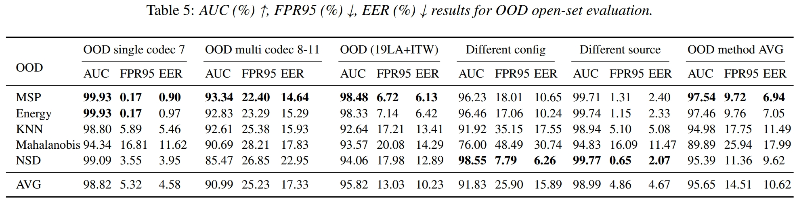
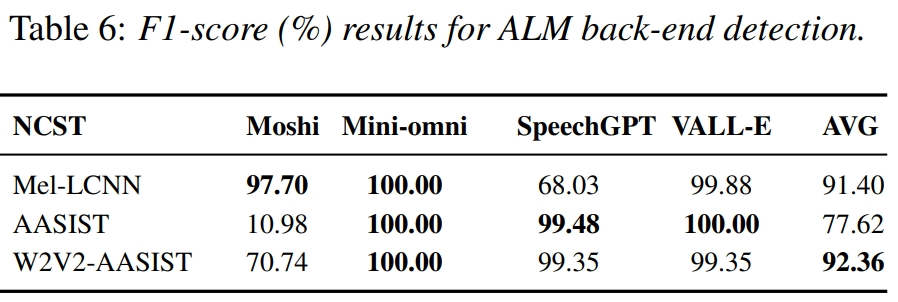

This is the repo of our work titled “Neural Codec Source Tracing: Toward Comprehensive Attribution in Open-Set Condition”, which was available on arxiv at https://arxiv.org/pdf/2501.06514.

Due to platform restrictions on the size of zenodo repositories, we have divided the Codecfake dataset into two subsets as shown in the table below:

| ST-Codecfake            | Description                                      | Link                                                                 |
|-------------------------|--------------------------------------------------|----------------------------------------------------------------------|
| main part               | training, development, evaluation (ID & OOD)     | [https://zenodo.org/records/14631091](https://zenodo.org/records/14631091) |
| open-set evaluation part| ID config, ID source, OOD config, OOD source, ALM| [https://zenodo.org/records/14631085](https://zenodo.org/records/14631085) |


### 1. Data prepraring

Upon downloading the ST-Codecfake datasets, please arrange them in accordance with the directory structure outlined below. If any path errors occur, please modify the 'Data folder prepare' section in config.py accordingly.

```
├── st-codecfake
│   ├── label
│   │   └── *.txt
│   ├── train
│   │   └── *.wav (ID 0-6, 10000*7 = 70000 samples)
│   ├── dev
│   │   └── *.wav (ID 0-6, 1000*7 = 7000 samples)
│   ├── eval_id
│   │   └── *.wav (ID 0-6, 13228*7 = 92596 samples)
│   ├── eval_ood
│   │   └── *.wav (ID 7-11, 13228*5 = 66140 samples)

│   ├── ID_unseen_real
│   │   └── 19LA (Please download ASVspoof2019LA and replace the configuration paths: id_unseenreal_19_wav, id_unseenreal_19_label)
│   │   └── ITW  (Please download In The Wild and replace the configuration paths: id_unseenreal_itw_wav, id_unseenreal_itw_label)
│   │   └── NCSSD (Please download NCSSD and replace the configuration path: id_unseenreal_ncssd)


│   ├── ID_diff_config
│   │   └── C3-1
│   │        └── *.wav (ID 3, 10000 samples)
│   │   └── C3-2
│   │        └── *.wav (ID 3, 10000 samples)
│   │   └── C3-3
│   │        └── *.wav (ID 3, 10000 samples)
│   │   └── C3-4
│   │        └── *.wav (ID 4, 10000 samples)
│   │   └── C4-1
│   │        └── *.wav (ID 4, 10000 samples)
│   │   └── C4-2
│   │        └── *.wav (ID 4, 10000 samples)
│   │   └── C4-3 
│   │        └── *.wav (ID 4, 10000 samples)

│   ├── ID_diff_source
│   │   └── NCSSD-mimi
│   │        └── *.wav (ID 1, 10000 samples)
│   │   └── NCSSD-snac
│   │        └── *.wav (ID 6, 10000 samples)


│   ├── OOD_diff_source
│   │   └── NCSSD_wavtokenizer
│   │        └── *.wav (OOD 7, 10000 samples)

│   ├── OOD_diff_config
│   │   └── wavtokenizer_small40
│   │        └── *.wav (OOD 7, 10000 samples)

│   ├── ALM
│   │   └── moshi
│   │        └── *.wav (10000 samples)
│   │   └── mini-omni
│   │        └── *.wav (10000 samples)
│   │   └── speechgpt-gen
│   │        └── *.wav (18 samples)
│   │   └── valle
│   │        └── *.wav (10000 samples)

```
Three unseen real dataset:

[ASVspoof2019 LA Database](https://datashare.ed.ac.uk/handle/10283/3336)

[In The Wild](https://deepfake-demo.aisec.fraunhofer.de/in_the_wild)

[NCSSD](https://huggingface.co/datasets/walkerhyf/NCSSD)

### 2. Environment Setup

`pip install -r requirements.txt`

### 3. Training the Neural Codec Source Tracing Model

`python main_train.py `

To change the source tracing model, please refer to config.py --model, choices=['Rawaasist', 'W2VAASIST', 'mellcnn']

### 4. Evaluation

#### ID close-set classification evaluation
<p align="center">
  
</p>

1. `python source_tracing_id.py `  
Generate id logits in `result/result_id.txt`

2. `python evaluate_id_f1.py `  
Compute id f1-score by `result/result_id.txt`


#### ID other evaluation
<p align="center">
  
</p>


1. `python source_tracing_id_other.py `

    Generate id different source logits in `./result/result_ncssd_mimi.txt` `./result/result_ncssd_snac.txt` 

    Generate id different config logits in `./result/result_{C*}.txt`

    Generate id unseen real logits in   `./result/result_unseenreal_19.txt`,
        `./result/result_unseenreal_ncssd.txt`,
        `./result/result_unseenreal_itw.txt`


2. `python evaluate_id_config.py ` compute f1-score

3. `python evaluate_id_source.py ` compute f1-score

4. `python evaluate_id_unseenreal.py ` compute f1-score

#### OOD open-set evaluation
<p align="center">
  
</p>

1. `python source_tracing_ood.py` save all evaluation condition feature and logits in `./save_feats`

2. `python ood_detector_e2e.py` 

    To change the test conditions, modify --condition, choices=['single7', 'multi8', 'voc', 'diff_config', 'diff_source']

    To change the OOD methods, modify --ood_detector_name, choices=['energy', 'msp', 'NSD',  'mahalanobis',  'knn']


#### ALM detection 

<p align="center">
  
</p>

1. `python source_tracing_ALM.py` Generate alm logits in `result/alm` folder

2. `python evaluate_alm.py`  Compute f1-score 


##  Thanks
NCSSD dataset
```
@inproceedings{liu2024generative,
  title={Generative expressive conversational speech synthesis},
  author={Liu, Rui and Hu, Yifan and Ren, Yi and Yin, Xiang and Li, Haizhou},
  booktitle={Proceedings of the 32nd ACM International Conference on Multimedia},
  pages={4187--4196},
  year={2024}
}
```


## 📝 Citation

If you find our dataset or countermeasure is useful to your research, please cite it as follows:

```
@article{xie2025neural,
  title={Neural Codec Source Tracing: Toward Comprehensive Attribution in Open-Set Condition},
  author={Xie, Yuankun and Wang, Xiaopeng and Wang, Zhiyong and Fu, Ruibo and Wen, Zhengqi and Cao, Songjun and Ma, Long and Li, Chenxing and Cheng, Haonnan and Ye, Long},
  journal={arXiv preprint arXiv:2501.06514},
  year={2025}
}
```